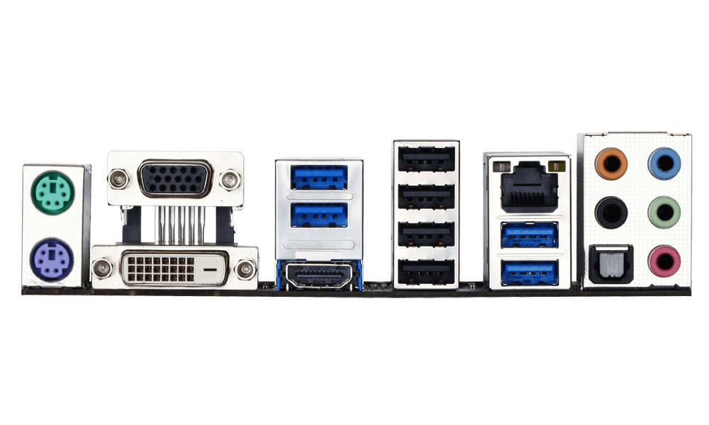

# Clover 配置说明

- 主板  ： <u>Z97X-UD3H ver 1.2</u>
- 显卡  ： <u>盈通 RX560D</u>(已刷amd RX580 bios)
- 版本  ： <u>Clover 5098</u>
- 系统  ： IMac 15,1

|      |      |      | HS13 |      |      |      |
| ---- | :--: | :--: | :--: | :--: | :--: | :--: |
|      |      | SS06 | HS14 | LAN  |  红  |  蓝  |
| 鼠标 | VGA  | SS05 | HS05 | SS04 |  黑  |  绿  |
| 键盘 | DVI  | HDMI | HS06 | SS03 |      |  粉  |

| SS01 |      |      |      |
| :--: | :--: | :--: | :--: |
| HS11 |  绿  |  粉  | HS12 |

1. HS01 - Controller XHC 

2. HS02 - Controller XHC

3. HS03 - Controller XHC

4. HS04 - Controller XHC

5. HS05 - Controller XHC
  
   - 2.0后置中-底
   
6. HS06 - Controller XHC
  
   - 2.0后置底
   
7. HS07 - Controller XHC

8. HS08 - Controller XHC

9. HS09 - Controller XHC   3.0
  
    - 
    
10. HS10 - Controller XHC   3.0
  
    - USB3.0 Hub
    
      ​        `-` USB Storage
    
11. HS11 - Controller XHC   2.0
  
    - 2.0 前置左   
    
12. HS12 - Controller XHC   2.0
  
    - 2.0 前置右 
    
13. HS13 - Controller XHC   2.0

      \- USB Gaming KB 

14. HS14 - Controller XHC   2.0

      \- USB GAMING MOUSE

15. PR11 - Controller EH01

    - hub_device

16. PR12 - Controller EH01

17. PR13 - Controller EH01

18. PR14 - Controller EH01

19. PR15 - Controller EH01

20. PR16 - Controller EH01

21. PR17 - Controller EH01

22. PR18 - Controller EH01

23. PR21 - Controller EH02

    - hub_device

24. PR22 - Controller EH02

25. PR23 - Controller EH02

26. PR24 - Controller EH02

27. PR25 - Controller EH02

28. PR26 - Controller EH02

   #######################################################
 #                  3.0 Ports                    #
#######################################################

1. HS05 - Controller XHC

2. HS06 - Controller XHC

3. HS11 - Controller XHC

4. HS12 - Controller XHC

5. HS13 - Controller XHC
  
    - Gaming KB 
    
6. HS14 - Controller XHC
  
    - USB GAMING MOUSE 
    
7. SS01 - Controller XHC
  
    - 前置 USB 3.0
    
8. SS02 - Controller XHC

9. SS03 - Controller XHC

   - -- Ultra USB 3.0

10. SS04 - Controller XHC

   - -- Ultra USB 3.0

11. SS05 - Controller XHC

    - 后置左 3.0

12. SS06 - Controller XHC 3.0
    -  --USB3.0 Hub
           -- Ultra USB 3.0
      
      ​     -- USB DISK

13. PR11 - Controller EH01

    - hub_device

14. PR12 - Controller EH01

15. PR13 - Controller EH01

16. PR14 - Controller EH01

17. PR15 - Controller EH01

18. PR16 - Controller EH01

19. PR17 - Controller EH01

20. PR18 - Controller EH01

21. PR21 - Controller EH02

    - hub_device

22. PR22 - Controller EH02

23. PR23 - Controller EH02

24. PR24 - Controller EH02

25. PR25 - Controller EH02

26. PR26 - Controller EH02

